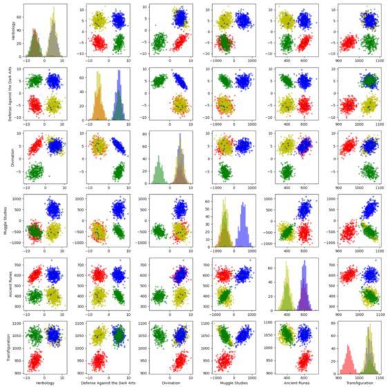
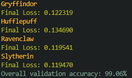

# DSLR 
_When the Sorting Hat breaks down, even Hogwarts needs a data scientist.
The solution ?_ **Multi-class logistic regression**. _No wand required._ </br>
*A 42 project*

Given students's grade data, the model predicts their Hogwarts house using a **one-vs-all logistic regression** trained with **gradient descent**.

## Algorithm and Data Flow

This pair plot shows the **distribution of the features** selected for our model, highlighting the **linear separability** between the four houses.



The classifier implements a **One-vs-All strategy**: one binary logistic regression model is trained per house, each learning to distinguish its house from all others.

Each model applies an **affine function** to the input features, then passes the result trought a **sigmoid activation** function to output a probability between 0 (false) and 1 (true).</br> Parameters **are optimize via gradient descent** by minimizing the **binary cross-entropy loss**.

Once trained, the predicted house is the one whose model **returns the highest probability**.

### Result



The model achieves **99.06% accuracy** on the validation set, with consistent
cross-entropy loss below 0.135 across all four classifiers.

## Installing and Usage
This project uses [Python](https://www.python.org/).</br>
Clone the repository and install the dependencies:

```
git clone <repo>
cd dslr
pip install -r requirements.txt
```

Train the model and run predictions:
```
python train.py data/raw/dataset_train.csv    # trains the model and saves parameters 
python predict.py data/raw/dataset_test.csv  # loads the model and predicts house for students
